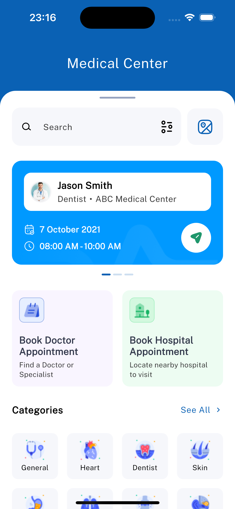
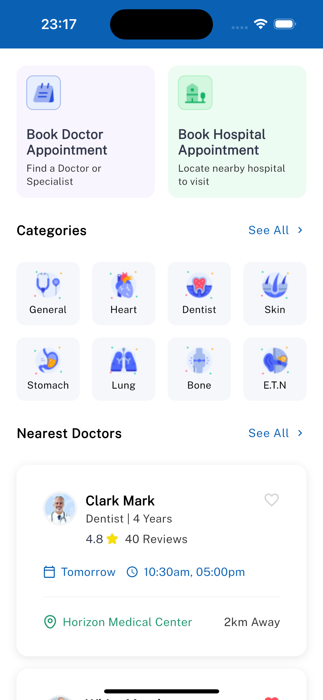
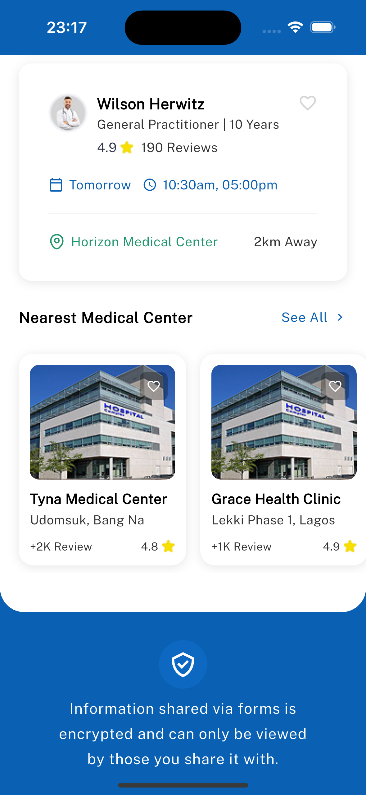

# 🏥 Medical Center Dashboard

A **pixel-perfect Flutter UI** built as part of the **Senior Flutter Developer Take-Home Assessment**.
This project replicates the provided Figma design for a *Medical Center Dashboard*, focusing purely on static layout, typography, spacing, and color fidelity.

---

## 📱 Overview

The dashboard displays a single scrollable page with the following sections:

1. **Header** – Search bar and quick actions
2. **Current Appointment Card** – Doctor and schedule info
3. **Quick Actions** – Book Doctor and Hospital appointment shortcuts
4. **Categories Grid** – List of medical service categories
5. **Nearest Doctors** – Vertical list of nearby doctors with ratings
6. **Nearest Medical Centers** – Horizontal list of nearby hospitals
7. **Security Info Card** – Privacy and encryption message

> 💡 All data used is static mock data. No backend integration, APIs, or state management libraries are used.

---

## 🧱 Tech Stack

* **Flutter 3.19+**
* **Dart 3.0+**
* **Google Fonts (Public Sans)**
* **Assets.gen (FlutterGen)**
* **Clean Widget Composition**
* **Static Mock Data**

---

## 🎨 Design Fidelity

* 100% **pixel-accurate** alignment with the provided Figma
* Consistent typography, spacing, shadows, and rounded corners
* Theme defined in `AppTheme` and `AppColors` for easy reuse

---

## ⚙️ Setup

```bash
flutter pub get
flutter run
```

For a release build:

```bash
flutter build apk --release
```

---

## 📸 Screenshots

Screenshots are located in the **`/screenshots`** folder.

| Top Section                 | Middle Section                    | Bottom Section                    |
| --------------------------- | --------------------------------- | --------------------------------- |
|  |  |  |

---

## 🔗 APK Download

**[Download APK via Diawi](https://i.diawi.com/C86Djt)**

---

## 🧾 Notes

* Fonts: `Public Sans` via Google Fonts
* Mock data only, no state management required
* Verified on iPhone 16 and Redmi Note 11S  Device

---

## 👨‍💻 Author

**David Timothy**
Senior Flutter Developer
📧 [[davidhenry889@gmail.com](mailto:davidhenry889@gmail.com)]

